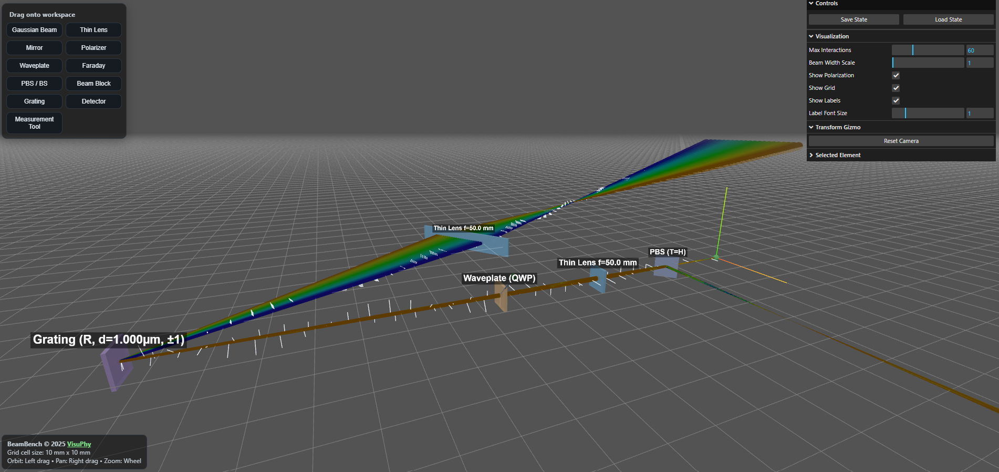

# BeamBench

[](https://www.gnu.org/licenses/gpl-3.0)

BeamBench is an interactive, browser-based 3D sandbox for designing and simulating optical systems. It provides real-time visualization of Gaussian beam propagation and polarization effects, making it an ideal tool for students, educators, and researchers to prototype and understand complex optical setups.

### [🚀 Launch the Live Demo 🚀](https://visuphy.github.io/BeamBench/)



## Key Features

*   **Interactive 3D Workspace:** Drag, drop, and manipulate optical components with intuitive on-screen gizmos for translation, rotation, and scaling.
*   **Comprehensive Component Library:** Build your system with a wide range of elements:
    *   Gaussian Beam Sources (including broadband)
    *   Lenses and Mirrors (flat, curved, and dichroic)
    *   Polarizers and Waveplates (HWP, QWP, custom)
    *   Faraday Rotators
    *   Beam Splitters (polarizing and non-polarizing)
    *   Diffraction Gratings (reflective and transmissive)
    *   Detectors, Beam Blocks, and a 3-Point Measurement Tool.
*   **Accurate Physics Engine:** The simulation is built on a robust physics engine that models:
    *   **Gaussian Beam Propagation** using the ABCD matrix formalism.
    *   **Polarization Transformations** using Jones calculus.
*   **Real-Time Analytics:** Select any component to view detailed readouts of the output beam's intensity, waist size, radius of curvature, polarization state (Ψ and χ), and other key parameters.
*   **Broadband Source Simulation:** Model sources with a defined spectral bandwidth and observe chromatic effects like dispersion from gratings.
*   **Save & Load:** Save your entire optical setup to a JSON file and load it back anytime. Full undo/redo history is supported.
*   **Zero Installation:** Runs entirely in your browser using WebGL and Three.js. No installation or plugins are required.

## Core Principles

The simulation is built on two fundamental methods used in optical physics: the ABCD matrix formalism for Gaussian beams and Jones calculus for polarization.

#### ABCD Matrix Formalism
This powerful technique describes the propagation of a Gaussian beam through an optical system. The state of the beam is captured by the complex beam parameter $q$, which encodes the beam's spot size $w(z)$ and wavefront radius of curvature $R(z)$. Each optical element is represented by a 2x2 "ABCD" matrix. By multiplying these matrices, we can accurately trace the evolution of the beam's properties throughout the entire system.

#### Jones Calculus
To model polarization, BeamBench uses Jones calculus. The polarization state of light is represented by a 2-element Jones vector. Optical elements that affect polarization, such as polarizers and waveplates, are represented by 2x2 Jones matrices. Applying an element's matrix to an incoming beam's vector precisely calculates the output polarization state.

By combining these methods, BeamBench offers a physically accurate and quantitative simulation of complex optical phenomena directly in your browser.

## How to Use

1.  **Open the [Live Demo](https://visuphy.github.io/BeamBench/).**
2.  **Add Components:** Drag elements from the palette on the left onto the main workspace.
3.  **Select & Modify:** Click on any component in the scene to select it.
4.  **Adjust Properties:**
    *   Use the **on-screen gizmos** at the bottom to translate, rotate, or resize the selected component.
    *   Use the **"Selected Element" panel** on the right to fine-tune its physical properties (e.g., focal length, reflectance, axis angle).
5.  **Analyze:** The "Output Beam Characteristics" panel provides a live-updating analysis of the beam immediately after it interacts with the selected component.
6.  **Save Your Work:** Use the "Save State" and "Load State" buttons to manage your designs.

## Running Locally

BeamBench is a static web application and does not require a complex build process. However, due to browser security policies regarding ES Modules (`import`/`export`), you must serve the files from a local web server.

1.  **Clone the repository:**
    ```sh
    git clone https://github.com/visuphy/BeamBench.git
    cd BeamBench
    ```

2.  **Start a local server:** A simple one-liner using Python is sufficient.
    *   If you have Python 3:
        ```sh
        python -m http.server
        ```
    *   If you have Python 2:
        ```sh
        python -m SimpleHTTPServer
        ```

3.  **Open in your browser:** Navigate to `http://localhost:8000` (or the address provided by your server).

## Author & License

*   **Original Author:** [Hussein-Tofaili](https://github.com/Hussein-Tofaili)
*   **Maintained by:** [VisuPhy](https://github.com/visuphy)

This project is licensed under the **GNU General Public License v3.0 or later**. See the `LICENSE` file for details.

## Contributing

Welcome, contributors! This web application is still in its beta phase, and we welcome your help in making it better.

*   **Found a bug or have a feature request?** Please [report it on our GitHub Issues page](https://github.com/visuphy/BeamBench/issues).
*   **Want to contribute code?** We are happy to review and accept pull requests. Feel free to fork the repository and submit your changes.

Your feedback and contributions are greatly appreciated